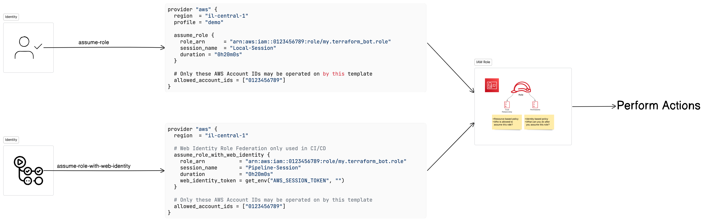

# Local vs Pipeline Assume Role Diagram



<p><a target="_blank" href="https://app.eraser.io/workspace/O9x9wF6pSk8QtwjyM0Gs" id="edit-in-eraser-github-link"></a></p>

When following best practices we generally use another IAM role to perform our actions. A genuine user can perform

```
aws sts assume-role \
--role-arn <value> \
--role-session-name <value> \
--profile <value>
```

However for our pipelines, authentication is generally done using different auth methods, such as OIDC (Open ID Connect) where an organisation is authenticated against our cloud account. If our case, It's GitHub and AWS.

Therefor, our pipeline with be assuming a role using a web identity, with is a little different. Also, there's no use of profile when running of a public or non-preconfigured private runner.

The following diagram show what method I could to handle such case of working both locally (e.g. delicate actions such as `destroy` ) vs following GitOps using a pipeline (e.g. running `plan` or `apply` ).

<!--- Eraser file: https://app.eraser.io/workspace/O9x9wF6pSk8QtwjyM0Gs --->

