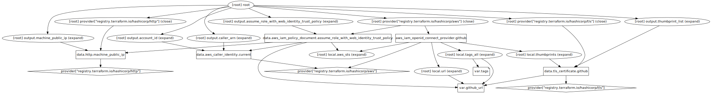

# Module "identity_provider"
---
## Example
---
```hcl
module "identity_provider" {
    source = "../../path/to/this/module"

    github_url = "token.actions.githubusercontent.com"
    tags       = {}
}
```

---

## Docs
---
## Requirements

| Name | Version |
|------|---------|
| <a name="requirement_aws"></a> [aws](#requirement\_aws) | ~> 3.0 |
| <a name="requirement_http"></a> [http](#requirement\_http) | 3.4.0 |

## Providers

| Name | Version |
|------|---------|
| <a name="provider_aws"></a> [aws](#provider\_aws) | 3.76.1 |
| <a name="provider_http"></a> [http](#provider\_http) | 3.4.0 |
| <a name="provider_tls"></a> [tls](#provider\_tls) | 4.0.4 |

## Modules

No modules.

## Resources

| Name | Type |
|------|------|
| [aws_iam_openid_connect_provider.github](https://registry.terraform.io/providers/hashicorp/aws/latest/docs/resources/iam_openid_connect_provider) | resource |
| [aws_caller_identity.current](https://registry.terraform.io/providers/hashicorp/aws/latest/docs/data-sources/caller_identity) | data source |
| [aws_iam_policy_document.assume_role_with_web_identity_trust_policy](https://registry.terraform.io/providers/hashicorp/aws/latest/docs/data-sources/iam_policy_document) | data source |
| [http_http.machine_public_ip](https://registry.terraform.io/providers/hashicorp/http/3.4.0/docs/data-sources/http) | data source |
| [tls_certificate.github](https://registry.terraform.io/providers/hashicorp/tls/latest/docs/data-sources/certificate) | data source |

## Inputs

| Name | Description | Type | Default | Required |
|------|-------------|------|---------|:--------:|
| <a name="input_github_url"></a> [github\_url](#input\_github\_url) | provide github domain for thumbprint capture (no protocol prefix). defaults to 'token.actions.githubusercontent.com'. | `string` | `"token.actions.githubusercontent.com"` | no |
| <a name="input_tags"></a> [tags](#input\_tags) | provide your own tags. | `map(string)` | `{}` | no |

## Outputs

| Name | Description |
|------|-------------|
| <a name="output_account_id"></a> [account\_id](#output\_account\_id) | n/a |
| <a name="output_assume_role_with_web_identity_trust_policy"></a> [assume\_role\_with\_web\_identity\_trust\_policy](#output\_assume\_role\_with\_web\_identity\_trust\_policy) | n/a |
| <a name="output_caller_arn"></a> [caller\_arn](#output\_caller\_arn) | n/a |
| <a name="output_machine_public_ip"></a> [machine\_public\_ip](#output\_machine\_public\_ip) | n/a |
| <a name="output_thumbprint_list"></a> [thumbprint\_list](#output\_thumbprint\_list) | n/a |

---

## Graph
---

