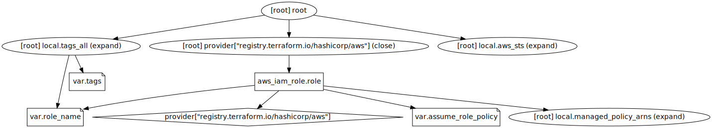

# Module "role"
---
## Example
---
```hcl
module "role" {
    source = "../../path/to/this/module"

    assume_role_policy = ""
    role_name          = "terraform_bot"
    tags               = {}
}
```

---

## Docs
---
## Requirements

| Name | Version |
|------|---------|
| <a name="requirement_aws"></a> [aws](#requirement\_aws) | ~> 3.0 |

## Providers

| Name | Version |
|------|---------|
| <a name="provider_aws"></a> [aws](#provider\_aws) | 3.76.1 |

## Modules

No modules.

## Resources

| Name | Type |
|------|------|
| [aws_iam_role.role](https://registry.terraform.io/providers/hashicorp/aws/latest/docs/resources/iam_role) | resource |

## Inputs

| Name | Description | Type | Default | Required |
|------|-------------|------|---------|:--------:|
| <a name="input_assume_role_policy"></a> [assume\_role\_policy](#input\_assume\_role\_policy) | provide a trust policy for this role. | `string` | n/a | yes |
| <a name="input_role_name"></a> [role\_name](#input\_role\_name) | provide a name for created role. | `string` | `"terraform_bot"` | no |
| <a name="input_tags"></a> [tags](#input\_tags) | provide your own tags. | `map(string)` | `{}` | no |

## Outputs

No outputs.

---

## Graph
---

