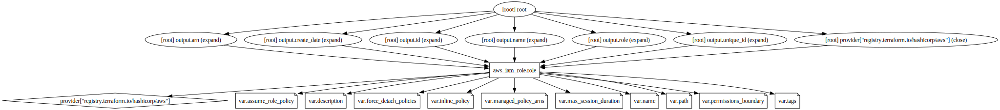

# Module "role"
---
- [Module \"role\"](#role)
- [Usage](#usage)
- [Docs](#docs)
- [Requirements](#requirements)
- [Providers](#providers)
- [Modules](#modules)
- [Resources](#resources)
- [Inputs](#inputs)
- [Outputs](#outputs)
- [Graph](#graph)"

# Usage
---
Paste the following snipped into your code to use the module.
```terraform
module "role" {
    source = "../../path/to/this/module"

    assume_role_policy    = ""
  description           = ""
  force_detach_policies = false
  inline_policy         = ""
  managed_policy_arns   = []
  max_session_duration  = 3600
  name                  = "terraform_bot"
  path                  = "/"
  permissions_boundary  = ""
  tags                  = {}
}
```

Run <kbd>terraform init</kbd> to initialize the module.

Run <kbd>terraform plan</kbd> to create the execution plan.

Run <kbd>terraform apply</kbd> to create the resources.

Run <kbd>terraform destroy</kbd> to destroy the resources.


---

# Docs
---
## Requirements

| Name | Version |
|------|---------|
| <a name="requirement_aws"></a> [aws](#requirement\_aws) | ~> 5.0 |

## Providers

| Name | Version |
|------|---------|
| <a name="provider_aws"></a> [aws](#provider\_aws) | 5.42.0 |

## Modules

No modules.

## Resources

| Name | Type |
|------|------|
| [aws_iam_role.role](https://registry.terraform.io/providers/hashicorp/aws/latest/docs/resources/iam_role) | resource |

## Inputs

| Name | Description | Type | Default | Required |
|------|-------------|------|---------|:--------:|
| <a name="input_assume_role_policy"></a> [assume\_role\_policy](#input\_assume\_role\_policy) | provide a trust policy for this role. | `string` | n/a | yes |
| <a name="input_description"></a> [description](#input\_description) | provide your description. | `string` | `""` | no |
| <a name="input_force_detach_policies"></a> [force\_detach\_policies](#input\_force\_detach\_policies) | Whether to force detaching any policies the role has before destroying it | `bool` | `false` | no |
| <a name="input_inline_policy"></a> [inline\_policy](#input\_inline\_policy) | provide an inline policy for this role. | `any` | `null` | no |
| <a name="input_managed_policy_arns"></a> [managed\_policy\_arns](#input\_managed\_policy\_arns) | provide a list of managed policy arns. | `list(string)` | `[]` | no |
| <a name="input_max_session_duration"></a> [max\_session\_duration](#input\_max\_session\_duration) | Limit this role's seesion duration (secounds). | `number` | `3600` | no |
| <a name="input_name"></a> [name](#input\_name) | provide a name for created role. | `string` | `"terraform_bot"` | no |
| <a name="input_path"></a> [path](#input\_path) | Path to the role | `string` | `"/"` | no |
| <a name="input_permissions_boundary"></a> [permissions\_boundary](#input\_permissions\_boundary) | ARN of the policy that is used to set the permissions boundary for the role. | `string` | `""` | no |
| <a name="input_tags"></a> [tags](#input\_tags) | provide your own tags. | `map(string)` | `{}` | no |

## Outputs

| Name | Description |
|------|-------------|
| <a name="output_arn"></a> [arn](#output\_arn) | n/a |
| <a name="output_create_date"></a> [create\_date](#output\_create\_date) | n/a |
| <a name="output_id"></a> [id](#output\_id) | n/a |
| <a name="output_name"></a> [name](#output\_name) | n/a |
| <a name="output_role"></a> [role](#output\_role) | n/a |
| <a name="output_unique_id"></a> [unique\_id](#output\_unique\_id) | n/a |

---

# Graph
---

